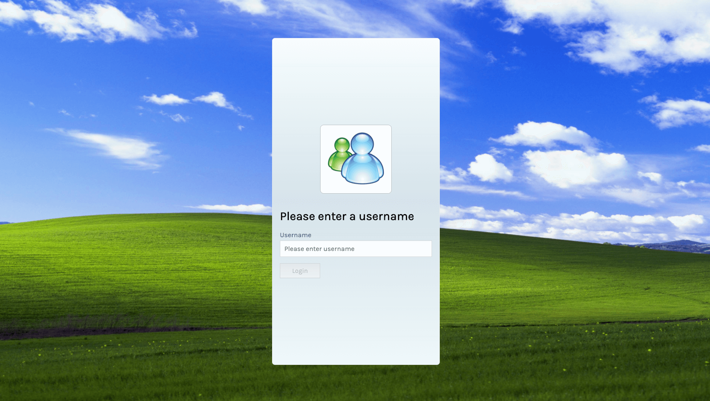

# Drum Pad
Demo: [https://drumpad-andrewb.netlify.com](https://drumpad-andrewb.netlify.com)

# Rules

Play a sound with keyboard or with mouse.

# Background
This is Day 6/100 of my #100DaysOfCode challenge on Twitter: [@andrewbdesign](https://twitter.com/andrewbdesign)

My focus was to build something for desktop. Haven't done any responsive designs to it. Feel free to Submit PRs. 

# Background sound credits
Found the drum audio files from [here](https://soundpacks.com/free-sound-packs/roland-mc-505-808-kit/)

# Local dev setup
In the project directory, you can run:

### `npm install`

This will install the necessary packages.

### `npm start`

Runs the app in the development mode. 
Open [http://localhost:3000](http://localhost:3000) to view it in the browser.

### `npm run build`

Builds the app for production to the `build` folder. 
