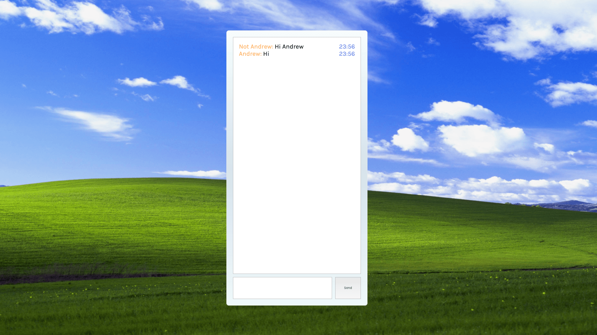

# Chat App
Demo: [https://chatapp-andrewb.herokuapp.com/](https://chatapp-andrewb.herokuapp.com/)

# Rules

Enter username.

# Background
This is Day 7/100 of my #100DaysOfCode challenge on Twitter: [@andrewbdesign](https://twitter.com/andrewbdesign)

Built this with socket.io, nodejs, and react.

# Local dev setup
In the project directory, you can run:

### `npm install`

This will install the necessary packages for the nodejs server.

### `cd client && npm install`

This will install the necessary packages for frontend.

### `npm run server`

Runs the server on [http://localhost:5000](http://localhost:5000).

### `npm run client`

Open [http://localhost:3000](http://localhost:3000) to view it in the browser.

